### Hi there 👋

I'm Marcel and GitHub is - at times - my second home.

<!--
**marcelstoer/marcelstoer** is a ✨ _special_ ✨ repository because its `README.md` (this file) appears on your GitHub profile.

Here are some ideas to get you started:

- 🔭 I’m currently working on ...
- 🌱 I’m currently learning ...
- 👯 I’m looking to collaborate on ...
- 🤔 I’m looking for help with ...
- 💬 Ask me about ...
- 📫 How to reach me: ...
- 😄 Pronouns: ...
- ⚡ Fun fact: ...
-->

### :octocat: Some statistics

<!-- https://github.com/anuraghazra/github-readme-stats -->

### :zap: Recent Activity

<!--START_SECTION:activity-->
1. 🎉 Merged PR [#7470](https://github.com/github/advisory-database/pull/7470) in [github/advisory-database](https://github.com/github/advisory-database)
2. 🎉 Merged PR [#3](https://github.com/ti8m/json-schema-viewer/pull/3) in [ti8m/json-schema-viewer](https://github.com/ti8m/json-schema-viewer)
3. 💪 Opened PR [#3](https://github.com/ti8m/json-schema-viewer/pull/3) in [ti8m/json-schema-viewer](https://github.com/ti8m/json-schema-viewer)
4. ❌ Closed PR [#8428](https://github.com/dependency-check/DependencyCheck/pull/8428) in [dependency-check/DependencyCheck](https://github.com/dependency-check/DependencyCheck)
5. 🗣 Commented on [#2284](https://github.com/bcgit/bc-java/issues/2284#issuecomment-4288071490) in [bcgit/bc-java](https://github.com/bcgit/bc-java)
6. 💪 Opened PR [#7470](https://github.com/github/advisory-database/pull/7470) in [github/advisory-database](https://github.com/github/advisory-database)
7. 🗣 Commented on [#2284](https://github.com/bcgit/bc-java/issues/2284#issuecomment-4287123274) in [bcgit/bc-java](https://github.com/bcgit/bc-java)
8. 🗣 Commented on [#8428](https://github.com/dependency-check/DependencyCheck/pull/8428#issuecomment-4260459256) in [dependency-check/DependencyCheck](https://github.com/dependency-check/DependencyCheck)
9. ℹ️ Unassigned issue [#8422](https://github.com/dependency-check/DependencyCheck/issues/8422) in [dependency-check/DependencyCheck](https://github.com/dependency-check/DependencyCheck)
10. 💪 Opened PR [#8428](https://github.com/dependency-check/DependencyCheck/pull/8428) in [dependency-check/DependencyCheck](https://github.com/dependency-check/DependencyCheck)
11. 🗣 Commented on [#10731](https://github.com/axios/axios/issues/10731#issuecomment-4259782892) in [axios/axios](https://github.com/axios/axios)
12. ℹ️ Assigned issue [#8422](https://github.com/dependency-check/DependencyCheck/issues/8422) in [dependency-check/DependencyCheck](https://github.com/dependency-check/DependencyCheck)
13. 🗣 Commented on [#8422](https://github.com/dependency-check/DependencyCheck/issues/8422#issuecomment-4258918784) in [dependency-check/DependencyCheck](https://github.com/dependency-check/DependencyCheck)
14. 🗣 Commented on [#8422](https://github.com/dependency-check/DependencyCheck/issues/8422#issuecomment-4258581431) in [dependency-check/DependencyCheck](https://github.com/dependency-check/DependencyCheck)
15. ❗ Opened issue [#27](https://github.com/marcelstoer/display-mail-user-agent-t/issues/27) in [marcelstoer/display-mail-user-agent-t](https://github.com/marcelstoer/display-mail-user-agent-t)
16. 🗣 Commented on [#8407](https://github.com/dependency-check/DependencyCheck/pull/8407#issuecomment-4234306389) in [dependency-check/DependencyCheck](https://github.com/dependency-check/DependencyCheck)
17. 🎉 Merged PR [#429](https://github.com/ThingPulse/esp8266-oled-ssd1306/pull/429) in [ThingPulse/esp8266-oled-ssd1306](https://github.com/ThingPulse/esp8266-oled-ssd1306)
18. 🔒 Closed issue [#428](https://github.com/ThingPulse/esp8266-oled-ssd1306/issues/428) in [ThingPulse/esp8266-oled-ssd1306](https://github.com/ThingPulse/esp8266-oled-ssd1306)
19. 🔒 Closed issue [#1231](https://github.com/gitlabform/gitlabform/issues/1231) in [gitlabform/gitlabform](https://github.com/gitlabform/gitlabform)
20. 🗣 Commented on [#19](https://github.com/marcelstoer/display-mail-user-agent-t/issues/19#issuecomment-4193070773) in [marcelstoer/display-mail-user-agent-t](https://github.com/marcelstoer/display-mail-user-agent-t)
<!--END_SECTION:activity-->

