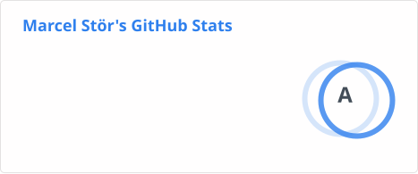
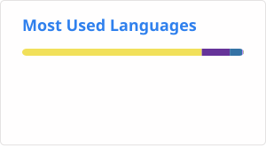

### Hi there 👋

I'm Marcel and GitHub is - at times - my second home.

<!--
**marcelstoer/marcelstoer** is a ✨ _special_ ✨ repository because its `README.md` (this file) appears on your GitHub profile.

Here are some ideas to get you started:

- 🔭 I’m currently working on ...
- 🌱 I’m currently learning ...
- 👯 I’m looking to collaborate on ...
- 🤔 I’m looking for help with ...
- 💬 Ask me about ...
- 📫 How to reach me: ...
- 😄 Pronouns: ...
- ⚡ Fun fact: ...
-->

### :octocat: Some statistics

<!-- https://github.com/anuraghazra/github-readme-stats -->

### :zap: Recent Activity

<!--START_SECTION:activity-->
1. 🗣 Commented on [#1271](https://github.com/mc1arke/sonarqube-community-branch-plugin/issues/1271#issuecomment-5103410648) in [mc1arke/sonarqube-community-branch-plugin](https://github.com/mc1arke/sonarqube-community-branch-plugin)
2. 💪 Opened PR [#1](https://github.com/Erik-Donath/github-profile-trophy/pull/1) in [Erik-Donath/github-profile-trophy](https://github.com/Erik-Donath/github-profile-trophy)
3. 🎉 Merged PR [#1371](https://github.com/gitlabform/gitlabform/pull/1371) in [gitlabform/gitlabform](https://github.com/gitlabform/gitlabform)
4. 🗣 Commented on [#1371](https://github.com/gitlabform/gitlabform/pull/1371#issuecomment-5033842690) in [gitlabform/gitlabform](https://github.com/gitlabform/gitlabform)
5. 🗣 Commented on [#1371](https://github.com/gitlabform/gitlabform/pull/1371#issuecomment-5033755013) in [gitlabform/gitlabform](https://github.com/gitlabform/gitlabform)
6. 💪 Opened PR [#1371](https://github.com/gitlabform/gitlabform/pull/1371) in [gitlabform/gitlabform](https://github.com/gitlabform/gitlabform)
7. 🎉 Merged PR [#2329](https://github.com/superfly/docs/pull/2329) in [superfly/docs](https://github.com/superfly/docs)
8. 🗣 Commented on [#8422](https://github.com/dependency-check/DependencyCheck/issues/8422#issuecomment-4980057721) in [dependency-check/DependencyCheck](https://github.com/dependency-check/DependencyCheck)
9. 🗣 Commented on [#3](https://github.com/ThingPulse/esp32-spotify-remote/issues/3#issuecomment-4950530815) in [ThingPulse/esp32-spotify-remote](https://github.com/ThingPulse/esp32-spotify-remote)
10. 🗣 Commented on [#29](https://github.com/spring-io/spring-calendar/issues/29#issuecomment-4925255977) in [spring-io/spring-calendar](https://github.com/spring-io/spring-calendar)
11. ❗ Opened issue [#29](https://github.com/spring-io/spring-calendar/issues/29) in [spring-io/spring-calendar](https://github.com/spring-io/spring-calendar)
12. 🗣 Commented on [#8653](https://github.com/dependency-check/DependencyCheck/issues/8653#issuecomment-4904729888) in [dependency-check/DependencyCheck](https://github.com/dependency-check/DependencyCheck)
13. 🗣 Commented on [#8653](https://github.com/dependency-check/DependencyCheck/issues/8653#issuecomment-4904371832) in [dependency-check/DependencyCheck](https://github.com/dependency-check/DependencyCheck)
14. 🎉 Merged PR [#8052](https://github.com/github/advisory-database/pull/8052) in [github/advisory-database](https://github.com/github/advisory-database)
15. ❌ Closed PR [#13](https://github.com/marcelstoer/junit-references/pull/13) in [marcelstoer/junit-references](https://github.com/marcelstoer/junit-references)
16. 🗣 Commented on [#12](https://github.com/marcelstoer/junit-references/pull/12#issuecomment-4841541267) in [marcelstoer/junit-references](https://github.com/marcelstoer/junit-references)
17. 💪 Opened PR [#8245](https://github.com/github/advisory-database/pull/8245) in [github/advisory-database](https://github.com/github/advisory-database)
18. 💪 Opened PR [#8052](https://github.com/github/advisory-database/pull/8052) in [github/advisory-database](https://github.com/github/advisory-database)
19. 🗣 Commented on [#8614](https://github.com/dependency-check/DependencyCheck/issues/8614#issuecomment-4726587038) in [dependency-check/DependencyCheck](https://github.com/dependency-check/DependencyCheck)
20. 💪 Opened PR [#1561](https://github.com/tasmota/docs/pull/1561) in [tasmota/docs](https://github.com/tasmota/docs)
<!--END_SECTION:activity-->

